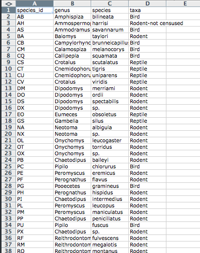

Authors: **Christie Bahlai**, **Aleksandra Pawlik** 
Contributors: **Jennifer Bryan**, **Alexander Duryee**, **Jeffrey Hollister**, **Daisie Huang**, **Owen Jones**, 
**Ben Marwick** and **Sebastian Kupny**.

## Learning Objectives
* Learning best practices for recording and formatting data in spreadsheets
* Understanding the correspondence between columns and rows in spreadsheets 
and data structure
* Understanding the correspondence between spreadsheet cells, columns and rows 
and data observations and values

The most common mistake made is treating the 
program like it is a lab notebook- that is, relying on context, notes in the 
margin, spatial layout of data and fields to convey information. As humans, 
we can (usually) interpret these things, but computers are dumb, and unless 
we explain to the computer what every single thing means, it will not be able 
to see how our data fit together.

Using the power of computers, we can manage and analyze data in much more 
effective and faster ways, but to use that power, we have to set up
our data for the computer to be able to understand it (and computers are very 
literal).

This is why it’s extremely important to set up well-formatted tables from the 
outset- before you even start entering data from your very first preliminary 
experiment. **Data organization is the foundation of your research project.**
It can make it easier or harder to work with your data throughout your
analysis, so it's worth thinking about when you're doing your data
entry or setting up your experiment. You can set things up in a different
way in spreadsheets, but it limits your ability to work with the data
in other programs or have the you-of-6-months-from-now or your collaborator
work with the data. 

###Structuring data in spreadsheets

There are two rules you should keep in mind when entering your data 
into any spreadsheet:

1. Each data cell is an observation that must have all the relevant information 
connected to it for it to stand on its own.

2. You must make it clear to the computer how the data cells relate to the 
relevant information and each other.

So, you can see how these two points apply directly to how you set up your 
spreadsheets. 

###Columns for variables and rows for observations

The rule of thumb, when setting up a datasheet, is columns= variables, 
rows = observations, cells=data (values).
Let's try this with an example using some of our sample data: [a list of 
species](../../../data/biology/species.csv) and 
[a list of plots](../../../data/biology/plots.csv). 
You can do that by simply opening the `*.csv` files in Excel. Excel will 
automatically try to fit the data from the `*.csv` file and put the first 
value in column A and the second value in column B. 

The output should look like this:

A common strategy is creating multiple data tables within 
one spreadsheet. **This confuses the computer, so don't do this!** 
When you create multiple tables within one 
spreadsheet, you’re drawing false associations between things for the computer, 
which sees each row as an observation. You’re also potentially using the same 
field name in multiple places, which will make it harder to clean your data up 
into a usable form. The example below depicts the problem:

But what about worksheet tabs? That seems like an easy way to organize data, right? Well, yes and no. When you create extra tabs, you fail to allow the computer to see connections in the data that are there (you have to introduce spreadsheet application-specific functions or scripting to ensure this connection). Say, for instance, you make a separate tab for each day you take a measurement.

This is bad practice for two reasons:   
**1)** you are more likely to accidentally add inconsistencies to your data if each time you take a measurement, you start recording data in a new tab, and   
**2)** even if you manage to prevent all inconsistencies from creeping in, you will add an extra step for yourself before you analyze the data because you will have to combine these data into a single datatable. You will have to explicitly tell the computer how to combine tabs - and if the tabs are inconsistently formatted, you might even have to do it by hand!

The next time you’re entering data, and you go to create another tab or table, I want you to ask yourself “Self, could I avoid adding this tab by adding another column to my original spreadsheet?”

Your data sheet might get very long over the course of experiment. This makes it harder to enter data if you can’t see your headers at the top of the spreadsheet. But do NOT repeat headers. These can easily get mixed into the data, leading to problems down the road.

Instead you can Freeze the column headers.

- Demonstration of freezing column headers

### Exercise

Two graduate students went out and collected data in 1977, 1978 and 1979. They
gave their data	to their advisor who put it in separate tabs in
the same spreadsheet.

- Using the survey_data_tab.xls spreadsheet in the 1977 tab, identify the 
things that would make it hard for a computer to understand and create a 
new spreadsheet with the data that fixes those problems.

Previous: [Introduction](00-intro.html)  Next: [Common formatting mistakes by spreadsheet users.](02-common-mistakes.html)
